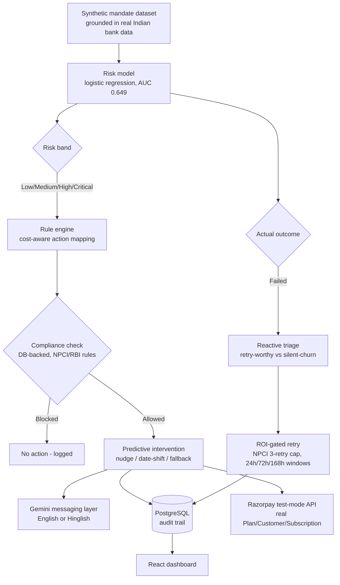

# FundGuard

**Predictive + reactive revenue recovery for UPI Autopay mandates.**

Built for Razorpay's AI Buildathon (Track 3: AI Revenue Recovery).

## The problem

UPI Autopay — India's dominant recurring-payment rail — has a structural failure problem. Typical mandate failure rates run 8–15%, spiking far higher in bad months, and NPCI data shows over 20 million mandates are revoked *every month*, largely due to insufficient balance at the moment of debit. Every existing recovery tool reacts after a payment has already failed.

Regulation already hands merchants a fix window they mostly waste: the RBI's 2026 E-Mandate Framework requires a mandatory 24–48h pre-debit notice before every mandate execution. Most merchants send that notice as a generic templated reminder. **FundGuard uses that window intelligently instead** — predicting which specific mandate is at risk and intervening before the debit attempt, not after.

## Architecture



## How it works

1. **Predict** — a logistic regression model, trained on synthetic mandate data grounded in real Indian bank transaction distributions, scores each upcoming mandate's failure risk.
2. **Decide** — a deterministic rule engine (not ML) maps that score to a bounded action, calibrated against real failure-rate-by-decile analysis, gated by mandate value so high-friction actions are reserved for mandates worth the friction.
3. **Comply** — every intervention is checked against real RBI/NPCI stopping rules (one active notice per customer, max one intervention per mandate per cycle) before it fires, enforced at the database level.
4. **Message** — Google Gemini drafts the actual customer-facing text, in English or Hinglish, constrained to never promise refunds or use threatening language.
5. **React** — mandates that fail anyway get triaged (retry-worthy vs. genuinely disengaging) and retried only when the expected value clears the cost, within NPCI's real 3-retry legal limit.
6. **Prove it's real** — real Razorpay test-mode API calls create genuine Plan/Customer/Subscription objects, verifiable in Razorpay's own dashboard. Every decision is logged to a queryable Postgres audit trail.

## What's genuinely real vs. synthetic (stated plainly)

- **Real:** the model architecture, feature engineering, rule engine, compliance logic (all grounded in actual NPCI/RBI rules), the Gemini messaging layer, the full backend/database/frontend stack, and the Razorpay API integration (real test-mode objects, verifiable in their dashboard).
- **Synthetic:** the training data itself. No real UPI transaction dataset exists publicly, so I built a generator grounded in real distributions (from a public Indian bank transaction dataset) rather than inventing numbers outright. The trained model's specific coefficients are an artifact of this synthetic data — a real deployment would retrain on real mandate history, but the architecture and methodology would transfer directly.

## Tech stack

- **Data & ML:** Python, pandas, scikit-learn (logistic regression)
- **Backend:** FastAPI, SQLAlchemy, PostgreSQL
- **LLM:** Google Gemini API (`gemini-3.6-flash`)
- **Payments:** Razorpay API (test mode)
- **Frontend:** React, Vite, Tailwind CSS

## Local setup

```bash
# 1. Clone and enter the repo
git clone https://github.com/thunderbolt3-14/fundguard.git
cd fundguard

# 2. Python environment
python -m pip install -r requirements.txt   # or install packages listed in each phase

# 3. PostgreSQL
# Create a local database named "fundguard", then:
psql -U postgres -d fundguard -f backend/db_schema.sql

# 4. Environment variables (.env)
DATABASE_URL=postgresql://postgres:<password>@localhost:5432/fundguard
GEMINI_API_KEY=<your key>
RAZORPAY_KEY_ID=<your test-mode key>
RAZORPAY_KEY_SECRET=<your test-mode secret>

# 5. Generate the synthetic dataset and train the model
python data_gen/generate_data.py
python model/train_risk_model.py

# 6. Run the backend
python -m uvicorn backend.main:app --reload

# 7. Run the frontend (separate terminal)
cd frontend
npm install
npm run dev
```

## How it was built

A. Grounding in real data. No public dataset models UPI recurring mandates, so a real Indian bank transaction dataset (1M+ transactions, ~884K customers) was used to extract genuine statistical parameters — transaction amount distributions, per-customer balance volatility, day-of-month spending patterns (real evidence of salary-cycle clustering).

B. Generating synthetic customers. data_gen/generate_data.py uses those real parameters to invent 3,000 synthetic customers, each with a baseline balance, a volatility score, a salary day, and a recurring mandate amount — then simulates 6 billing cycles per customer (18,000 rows total). A separate, independent piece of logic decides whether each simulated debit succeeds or fails — including a "bad month" shock event whose probability is tied to that customer's own volatility — deliberately kept separate from the model's input features so the model has to genuinely learn the relationship, not just decode a formula. After several calibration passes, this reached a realistic 14–18% failure rate matching NPCI's real-world numbers.

C. Training the risk model. model/train_risk_model.py splits customers (not rows) into train/test so no customer leaks across the split, then trains a logistic regression on 6 features (amount, balance, days-since-salary, recent failure rate, amount-to-balance ratio, balance volatility) to predict failure. Final result: AUC 0.649, evaluated on customers the model never saw. The trained model and its scaler are saved to model/risk_model.joblib; the evaluation metrics are saved separately to model/model_metrics.json so they're servable via API.

D. Building the decision logic. rules/rule_engine.py calibrates four risk bands (Low/Medium/High/Critical) directly against real failure-rate-by-decile data, then maps risk + mandate value to one of five bounded actions. rules/reactive_triage.py encodes real NPCI retry limits (max 3 retries, staggered 24h/72h/168h windows) and classifies failures as retry-worthy or silent-churn, gated by an ROI calculation. None of this is machine-learned — it's deterministic, because these are regulatory facts and business policy, not probabilistic judgment calls.

E. Building the messaging layer. messaging/generate_message.py wraps the Gemini API with per-action prompt templates, a guardrail system prompt (no promises, no threats, no fabricated details), and an English/Hinglish tone option.

F. Building the persistence and API layer. PostgreSQL holds four tables (customers, mandates, cycle_events, messages). backend/orchestrator.py is the single function that ties every piece above together into one pipeline. FastAPI exposes it via /run-batch (write) and /stats, /events, /model-info (read).

G. Building the frontend. A React dashboard, styled with real colors extracted from Razorpay's own brand, calls those endpoints to show live batch runs, an expandable audit trail, and a standalone message-preview widget.

## What happens when the system actually runs — one mandate's journey

A batch is triggered — either a live click of "Run Batch" on the dashboard, or a curl request — specifying how many mandates to process, whether to generate messages, which tone, and whether to create real Razorpay objects.

Random rows are sampled from the 18,000-row synthetic dataset (not always the same starting rows — this was a fix made after discovering repeated demo runs kept hitting already-processed, compliance-blocked customers).

For each row: the customer and mandate are looked up or created in Postgres (with a concurrency-safe fallback if two requests collide on the same new customer).

The risk model scores the mandate — its 6 features go through the saved scaler and logistic regression, producing a probability of failure.

The rule engine decides a risk band and a candidate action — but before that action is allowed to fire, a real database query checks compliance: does this customer already have an active notice this cycle? Has this mandate already gotten an intervention this cycle? If either is true, the action is downgraded to no_action and the block is logged.

A deterministic reason code is computed — the model's own coefficients multiplied by this specific customer's standardized feature values, ranked by contribution, turned into a plain-English explanation.

The ground-truth outcome is checked (in this synthetic system, this is the pre-generated label; in a real deployment, this would come from a payment gateway webhook days later) .  

If it failed:
Reactive triage runs — classifying the failure as retry-worthy (marginal or severe shortfall) or silent-churn (recent failure pattern suggests disengagement, not cash shortage — in which case retries are hard-blocked regardless of ROI math). For retry-worthy cases, an expected-value calculation weighs estimated recovery against processing and friction costs, scheduling a retry only if it clears that bar, within NPCI's 3-attempt legal limit.

If messaging is enabled and an action fired (capped at 2–4 per batch to respect Gemini's daily quota), Gemini generates the actual customer-facing text — in English or Hinglish — following the guardrails.

If Razorpay integration is enabled and this is a genuinely new mandate, real API calls create an actual test-mode Plan, Customer, and Subscription in Razorpay's system — verifiable in their own dashboard.

Everything is written to cycle_events (and messages, if generated) — this row is now a permanent, queryable audit record.

The batch finishes, returns a summary (counts of each action, failures, blocks, messages, Razorpay objects created), and the dashboard refreshes — pulling fresh cumulative stats and the newest events from the database, with the newly-created rows briefly highlighted.

A judge (or you) can click into any row and see the complete decision record: the risk score, why it was flagged, whether it was blocked and why, how it was triaged if it failed, what message was generated, and the real Razorpay subscription ID if one exists — the full "would you trust it" audit trail, end to end.

## Real challenges and how I solved them

**Calibrating a realistic failure rate.** My first synthetic-data model gave a 3.77% failure rate — far below NPCI's real 8–15%. I diagnosed the cause (continuous noise couldn't push small subscription amounts below a large balance), and fixed it by modeling failures the way they actually happen: not smooth and continuous, but clustered in occasional "bad months" — a discrete shock event, reaching a realistic 14.6%.

**A feature fix that broke something else.** Tying failure risk to customer volatility improved data realism but dropped my model's AUC from 0.604 to 0.589, because the model could no longer see the variable now driving most of the outcome. I fixed it by adding "balance volatility" as a real feature — reframed honestly as a proxy obtainable via India's Account Aggregator framework, not an invented shortcut — lifting AUC to 0.649.

**Compliance rules that looked right in a test script but weren't wired into production.** A full audit before building the frontend found that my NPCI/RBI-based stopping rules only existed in a standalone demo script, never the live API. I fixed this with a real database-backed compliance check, verified with real blocks in production testing.

**A silent-churn override that didn't actually override.** My first ROI model let disengaging customers get retried anyway, since even a 10% success chance cleared the tiny processing-cost math. I fixed it by making silent-churn a hard categorical override rather than a probability input — recognizing that annoying someone who's leaving has a real cost a few-rupee fee doesn't capture.

**Gemini's free-tier limits, hit twice.** First, a truncation bug (newer Gemini models spend the token budget on internal "thinking" before the visible answer) — I fixed it by raising the token budget and removing an incompatible parameter. Later, I hit the actual daily free-tier quota (20 requests/day) from heavy testing — I fixed this with graceful failure handling (a stuck message generation no longer crashes a whole batch) and a fast-fail retry setting, then simply waited for the daily reset.

**A demo-breaking bug found through dogfooding.** Repeated testing kept hitting the same early rows, which my own compliance rules correctly blocked on every re-run — making the dashboard look increasingly empty the more it was used. I fixed this by switching batch processing to random sampling instead of always starting from the same rows.

## Known limitations

- The trained model's specific weights are an artifact of synthetic data, not real UPI transaction history — a real deployment needs retraining on real mandate data.
- The reactive triage layer's retry-success probabilities are a documented heuristic, not a second learned model — a reasonable next-tier upgrade.
- No load testing has been done; this is a working prototype, not a production-scale system.
- Card-lifecycle triage is included in the taxonomy for extensibility but isn't applicable to this UPI-only build.

## License

MIT
