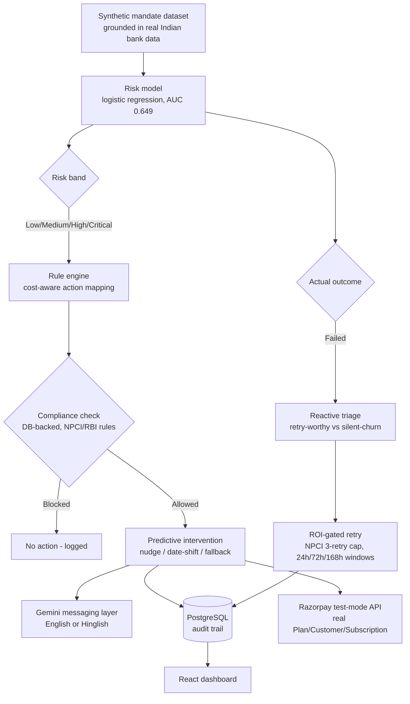

# FundGuard

**Predictive + reactive revenue recovery for UPI Autopay mandates.**

Built for Razorpay's AI Buildathon (Track 3: AI Revenue Recovery).

## The problem

UPI Autopay — India's dominant recurring-payment rail — has a structural failure problem. Typical mandate failure rates run 8–15%, spiking far higher in bad months, and NPCI data shows over 20 million mandates are revoked *every month*, largely due to insufficient balance at the moment of debit. Every existing recovery tool reacts after a payment has already failed.

Regulation already hands merchants a fix window they mostly waste: the RBI's 2026 E-Mandate Framework requires a mandatory 24–48h pre-debit notice before every mandate execution. Most merchants send that notice as a generic templated reminder. **FundGuard uses that window intelligently instead** — predicting which specific mandate is at risk and intervening before the debit attempt, not after.

## Architecture



## How it works

1. **Predict** — a logistic regression model, trained on synthetic mandate data grounded in real Indian bank transaction distributions, scores each upcoming mandate's failure risk.
2. **Decide** — a deterministic rule engine (not ML) maps that score to a bounded action, calibrated against real failure-rate-by-decile analysis, gated by mandate value so high-friction actions are reserved for mandates worth the friction.
3. **Comply** — every intervention is checked against real RBI/NPCI stopping rules (one active notice per customer, max one intervention per mandate per cycle) before it fires, enforced at the database level.
4. **Message** — Google Gemini drafts the actual customer-facing text, in English or Hinglish, constrained to never promise refunds or use threatening language.
5. **React** — mandates that fail anyway get triaged (retry-worthy vs. genuinely disengaging) and retried only when the expected value clears the cost, within NPCI's real 3-retry legal limit.
6. **Prove it's real** — real Razorpay test-mode API calls create genuine Plan/Customer/Subscription objects, verifiable in Razorpay's own dashboard. Every decision is logged to a queryable Postgres audit trail.

## What's genuinely real vs. synthetic (stated plainly)

- **Real:** the model architecture, feature engineering, rule engine, compliance logic (all grounded in actual NPCI/RBI rules), the Gemini messaging layer, the full backend/database/frontend stack, and the Razorpay API integration (real test-mode objects, verifiable in their dashboard).
- **Synthetic:** the training data itself. No real UPI transaction dataset exists publicly, so we built a generator grounded in real distributions (from a public Indian bank transaction dataset) rather than inventing numbers outright. The trained model's specific coefficients are an artifact of this synthetic data — a real deployment would retrain on real mandate history, but the architecture and methodology would transfer directly.

## Tech stack

- **Data & ML:** Python, pandas, scikit-learn (logistic regression)
- **Backend:** FastAPI, SQLAlchemy, PostgreSQL
- **LLM:** Google Gemini API (`gemini-3.6-flash`)
- **Payments:** Razorpay API (test mode)
- **Frontend:** React, Vite, Tailwind CSS

## Local setup

```bash
# 1. Clone and enter the repo
git clone https://github.com/thunderbolt3-14/fundguard.git
cd fundguard

# 2. Python environment
python -m pip install -r requirements.txt   # or install packages listed in each phase

# 3. PostgreSQL
# Create a local database named "fundguard", then:
psql -U postgres -d fundguard -f backend/db_schema.sql

# 4. Environment variables (.env)
DATABASE_URL=postgresql://postgres:<password>@localhost:5432/fundguard
GEMINI_API_KEY=<your key>
RAZORPAY_KEY_ID=<your test-mode key>
RAZORPAY_KEY_SECRET=<your test-mode secret>

# 5. Generate the synthetic dataset and train the model
python data_gen/generate_data.py
python model/train_risk_model.py

# 6. Run the backend
python -m uvicorn backend.main:app --reload

# 7. Run the frontend (separate terminal)
cd frontend
npm install
npm run dev
```

## Real challenges and how we solved them

**Calibrating a realistic failure rate.** Our first synthetic-data model gave a 3.77% failure rate — far below NPCI's real 8–15%. Diagnosed the cause (continuous noise couldn't push small subscription amounts below a large balance), and fixed it by modeling failures the way they actually happen: not smooth and continuous, but clustered in occasional "bad months" — a discrete shock event, reaching a realistic 14.6%.

**A feature fix that broke something else.** Tying failure risk to customer volatility improved data realism but dropped our model's AUC from 0.604 to 0.589, because the model could no longer see the variable now driving most of the outcome. Fixed by adding "balance volatility" as a real feature — reframed honestly as a proxy obtainable via India's Account Aggregator framework, not an invented shortcut — lifting AUC to 0.649.

**Compliance rules that looked right in a test script but weren't wired into production.** A full audit before building the frontend found that our NPCI/RBI-based stopping rules only existed in a standalone demo script, never the live API. Fixed with a real database-backed compliance check, verified with real blocks in production testing.

**A silent-churn override that didn't actually override.** Our first ROI model let disengaging customers get retried anyway, since even a 10% success chance cleared the tiny processing-cost math. Fixed by making silent-churn a hard categorical override rather than a probability input — recognizing that annoying someone who's leaving has a real cost a few-rupee fee doesn't capture.

**Gemini's free-tier limits, hit twice.** First, a truncation bug (newer Gemini models spend the token budget on internal "thinking" before the visible answer) — fixed by raising the token budget and removing an incompatible parameter. Later, we hit the actual daily free-tier quota (20 requests/day) from heavy testing — fixed with graceful failure handling (a stuck message generation no longer crashes a whole batch) and a fast-fail retry setting, then simply waited for the daily reset.

**A demo-breaking bug found through dogfooding.** Repeated testing kept hitting the same early rows, which our own compliance rules correctly blocked on every re-run — making the dashboard look increasingly empty the more you used it. Fixed by switching batch processing to random sampling instead of always starting from the same rows.

## Known limitations

- The trained model's specific weights are an artifact of synthetic data, not real UPI transaction history — a real deployment needs retraining on real mandate data.
- The reactive triage layer's retry-success probabilities are a documented heuristic, not a second learned model — a reasonable next-tier upgrade.
- No load testing has been done; this is a working prototype, not a production-scale system.
- Card-lifecycle triage is included in the taxonomy for extensibility but isn't applicable to this UPI-only build.

## License

MIT
